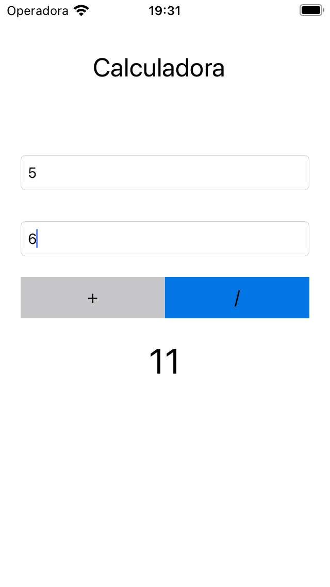

# Calculator Workspace
Criando e utilizando um framework dentro de um projeto iOS.
 
  ### Projeto desenvolvido ultilizando:
  - [x] Swift 5
  - [x] Framework
  - [x] StoryBoard
  - [x] Auto Layout
  
 ## Print Screen :foggy:
 
||
| ------- |
| using framework |
